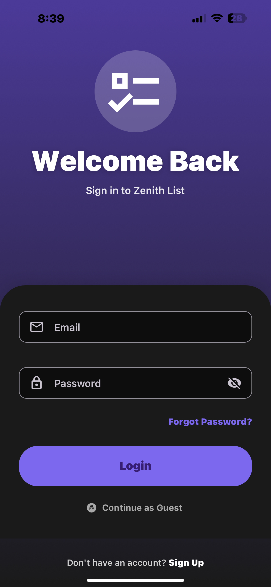
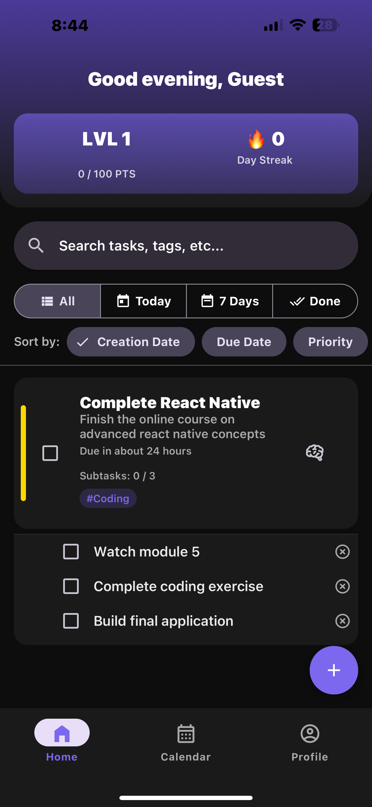
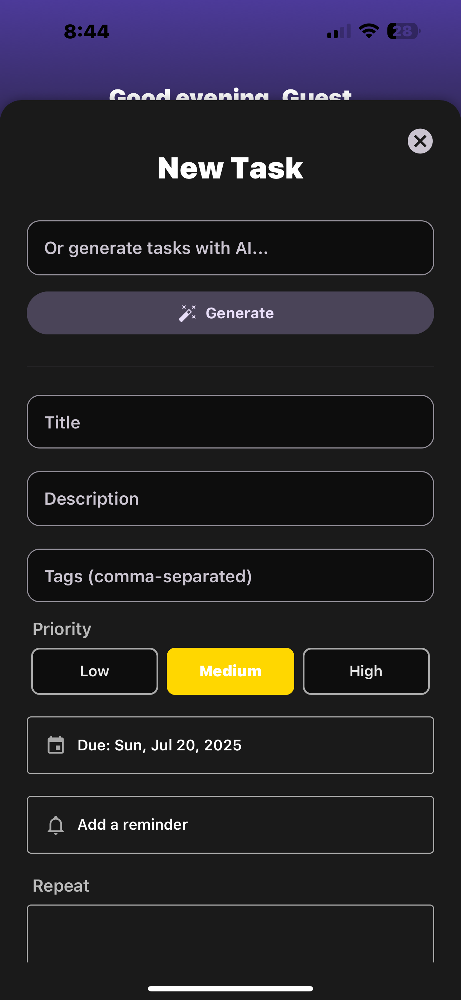
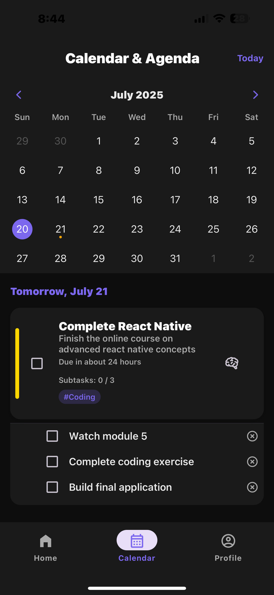
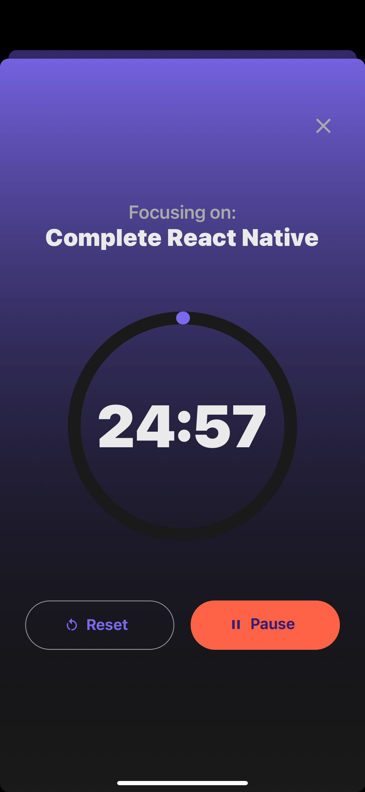
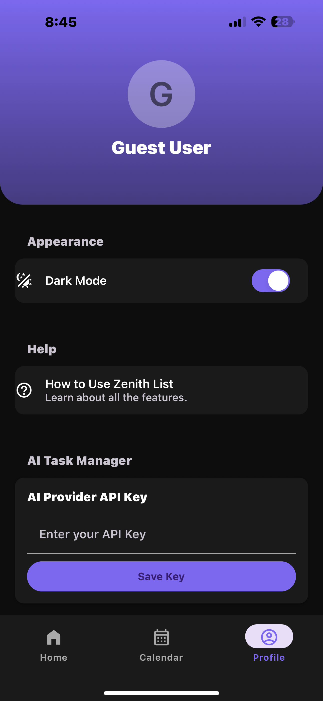

# Zenith List - Ultimate To-Do List & Productivity App


**Zenith List** is a feature-rich, production-grade mobile to-do list application built with React Native and Expo. It's designed to help you organize your tasks, stay focused, and gamify your productivity. With a sleek user interface, seamless Firebase integration, and powerful features like AI task generation, Zenith List is your ultimate companion for getting things done.

---

## 📸 App Preview

| Login Screen | Dashboard | Add Task Modal |
| :---: | :---: | :---: |
|  |  |  |
| **Calendar View** | **Focus Mode** | **Profile Screen** |
|  |  |  |

---

## ✨ Features

* **Firebase Authentication**: Secure user sign-up and login with email/password, plus an option for anonymous guest access.
* **Real-time Firestore Sync**: Tasks are instantly synchronized across devices thanks to Firestore's real-time listeners.
* **AI-Powered Task Generation**: Describe a complex goal (e.g., "plan a marketing campaign"), and let an AI model break it down into actionable sub-tasks for you.
* **Gamification System**:
    * **Points & Levels**: Earn points for completing tasks (more points for higher priority) and level up your profile.
    * **Daily Streaks**: Stay consistent by completing at least one task every day to build and maintain your productivity streak.
* **Advanced Task Management**:
    * **Subtasks**: Break down large tasks into smaller, checkable items.
    * **Priorities**: Assign High, Medium, or Low priority to tasks, visually indicated by a colored bar.
    * **Due Dates & Reminders**: Set deadlines and schedule local push notifications to remind you of important tasks.
    * **Recurring Tasks**: Set tasks to repeat daily, weekly, or monthly at custom intervals.
    * **Tags**: Organize tasks with comma-separated tags for easy searching and filtering.
* **Powerful Organization Tools**:
    * **Filtering**: Quickly view tasks for 'All', 'Today', 'Upcoming (7 days)', or 'Completed'.
    * **Sorting**: Arrange your list by creation date, due date, or priority.
    * **Grouping**: Group tasks by priority for a clear, organized view.
* **Calendar & Agenda View**: A full-screen calendar provides a visual overview of your schedule, with dots indicating task priorities. Below, an agenda lists all upcoming tasks for the next seven days.
* **Focus Mode**: A Pomodoro-style timer (25 minutes) to help you concentrate on a specific task, with a calming, animated background. The screen stays awake during the session.
* **Theming**: Seamlessly switch between a sophisticated dark mode and a clean light mode.
* **Intuitive UX**:
    * **Swipe Actions**: Swipe a task to the left to quickly edit or delete.
    * **Undo Delete**: A snackbar provides a window to undo an accidental deletion.
    * **Haptic Feedback**: Subtle vibrations enhance the user experience during interactions.
    * **Skeleton Loaders**: A smooth loading experience with shimmering placeholders while tasks are being fetched.
* **In-App Guide**: A dedicated "How to Use" screen explains all the features to help users get the most out of the app.

---

## 🚀 Technology Stack

* **Framework**: React Native with Expo (Managed Workflow)
* **Language**: JavaScript (ES6+)
* **Backend**: Firebase (Firestore for database, Firebase Authentication for users)
* **State Management**: React Context API with the `useReducer` pattern for clean and predictable state logic.
* **UI Components**: React Native Paper for a beautiful and consistent Material Design look and feel.
* **Navigation**: React Navigation (Stack Navigator & Material Bottom Tab Navigator).
* **Animations**: React Native Reanimated & React Native Gesture Handler for smooth, performant animations and gestures.
* **Styling**: StyleSheet API with theme-based styling.
* **Key Libraries**:
    * `expo-linear-gradient`: For beautiful gradient backgrounds in headers and other components.
    * `expo-haptics`: For providing tactile feedback.
    * `expo-notifications`: For scheduling local task reminders.
    * `expo-secure-store`: For securely storing the user's AI API key on the device.
    * `react-native-calendars`: For the interactive calendar view.
    * `date-fns`: For robust and reliable date manipulation.

---

## 🏁 Getting Started

### Prerequisites

* Node.js (LTS version recommended: 18.x or higher)
* npm or yarn
* Expo Go app on your iOS or Android device (for development)
* A Firebase project set up on the [Firebase Console](https://console.firebase.google.com/).

### Installation & Setup

1.  **Clone the repository:**
    ```bash
    git clone (https://github.com/PratikPisal4304/Ultimate_ToDo_List.git)
    cd zenith-list/ZenithList
    ```

2.  **Install dependencies:**
    ```bash
    npm install
    ```

3.  **Firebase Configuration:**
    * In your Firebase project, enable **Firestore Database** and **Firebase Authentication**.
    * In the Authentication -> Sign-in method tab, enable the **Email/Password** and **Anonymous** providers.
    * Create a new **Web App** in your Firebase project settings.
    * Copy your Firebase configuration credentials.
    * Create a `.env` file in the `ZenithList` root directory.
    * Add your Firebase credentials to the `.env` file using the following keys:
        ```env
        EXPO_PUBLIC_FIREBASE_API_KEY="YOUR_API_KEY"
        EXPO_PUBLIC_FIREBASE_AUTH_DOMAIN="YOUR_AUTH_DOMAIN"
        EXPO_PUBLIC_FIREBASE_PROJECT_ID="YOUR_PROJECT_ID"
        EXPO_PUBLIC_FIREBASE_STORAGE_BUCKET="YOUR_STORAGE_BUCKET"
        EXPO_PUBLIC_FIREBASE_MESSAGING_SENDER_ID="YOUR_MESSAGING_SENDER_ID"
        EXPO_PUBLIC_FIREBASE_APP_ID="YOUR_APP_ID"
        ```
    * The project is pre-configured in `app.json` and `firebaseConfig.js` to automatically use these environment variables.

4.  **Run the application:**
    ```bash
    npm start
    ```
    This will start the Metro bundler. Scan the generated QR code with the Expo Go app on your mobile device to launch the app.

---

## 📁 Project Structure

The project is organized to be scalable and maintainable, following best practices for React Native development.
```
ZenithList/
├── app/
│   ├── components/       # Reusable UI components (TaskItem, AddTaskModal, etc.)
│   ├── context/          # React Context providers (AuthContext, TasksContext, ThemeContext)
│   ├── firebase/         # Firebase service files (auth.js, firestore.js)
│   ├── hooks/            # Custom hooks for complex logic (useFilteredTasks, useUserData)
│   ├── navigation/       # Navigation configuration (RootNavigator, AppNavigator)
│   ├── screens/          # Application screens (DashboardScreen, ProfileScreen, etc.)
│   ├── services/         # External services logic (aiService.js)
│   └── notifications.js  # Notification scheduling logic
├── assets/               # App icons, fonts, and splash screens
├── docs/                 # Documentation files like the privacy policy
├── App.js                # Main app entry point where all providers are wrapped
├── app.json              # Expo configuration file, including environment variables
└── firebaseConfig.js     # Firebase initialization logic
```
---

## 🔐 AI Task Generation Setup

The AI task generation feature is designed to work with OpenAI's API but can be adapted. To use this feature, you must provide your own API key.

1.  Obtain an API key from your preferred AI provider (e.g., [OpenAI](https://platform.openai.com/)).
2.  Launch the Zenith List app and navigate to the **Profile** screen.
3.  In the "AI Task Manager" section, enter your API key.
4.  Tap "Save Key". The key is stored securely on your device using `expo-secure-store` and is never sent to our servers.
5.  You can now use the "Generate with AI" feature in the "New Task" modal to automatically create tasks from a prompt.

---

## 📜 License

This project is licensed under the MIT License - see the [LICENSE.md](LICENSE.md) file for details.

---

## 🤝 Contributing

Contributions are welcome! If you have suggestions for improvements or find a bug, please feel free to open an issue or submit a pull request.

1.  Fork the Project
2.  Create your Feature Branch (`git checkout -b feature/AmazingFeature`)
3.  Commit your Changes (`git commit -m 'Add some AmazingFeature'`)
4.  Push to the Branch (`git push origin feature/AmazingFeature`)
5.  Open a Pull Request

---

## 📧 Contact

Pratik Pisal - [pisalpratik2004@gmail.com](mailto:pisalpratik2004@gmail.com)

Project Link: [https://github.com/pratikpisal4304/ultimate_todo_list](https://github.com/pratikpisal4304/ultimate_todo_list)
